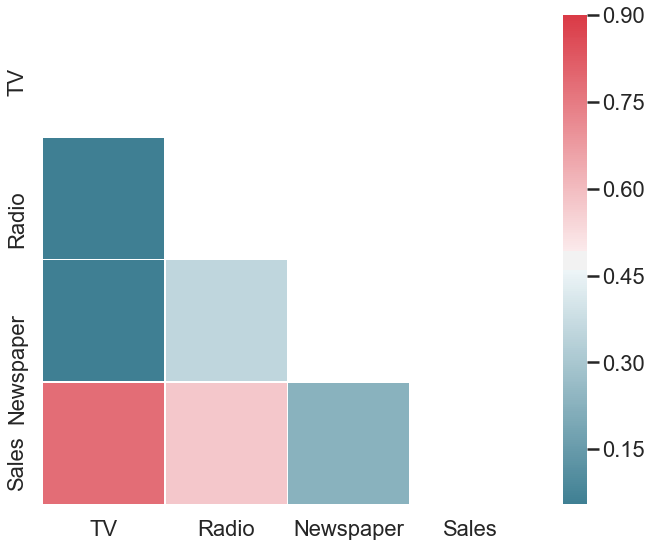
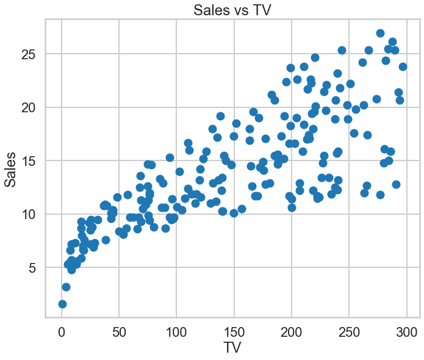
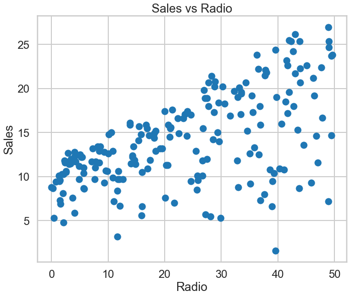
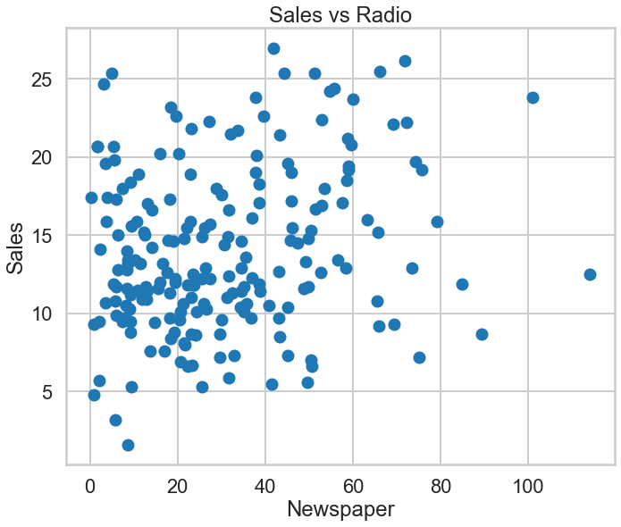
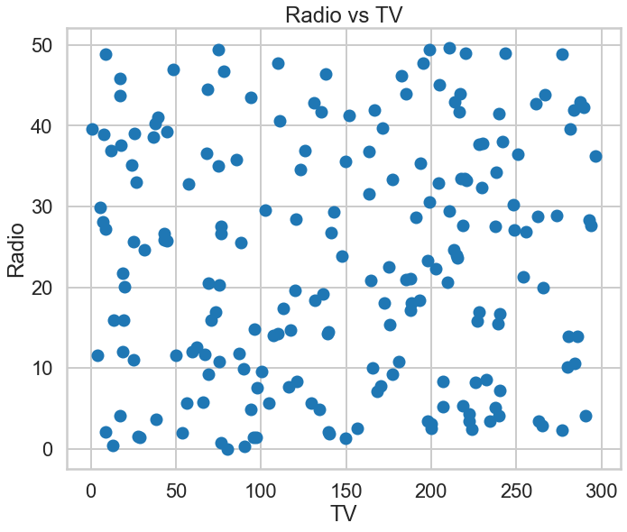
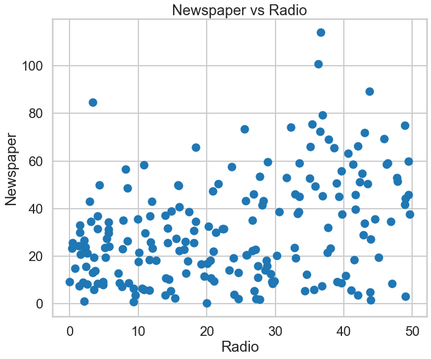
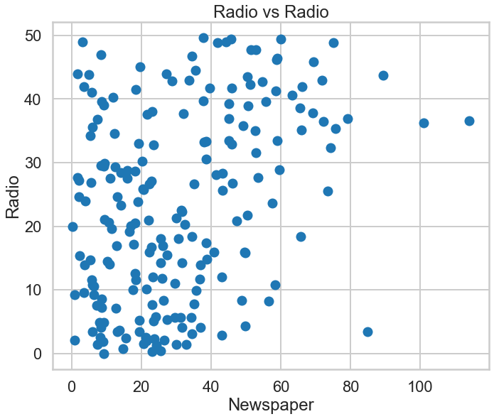
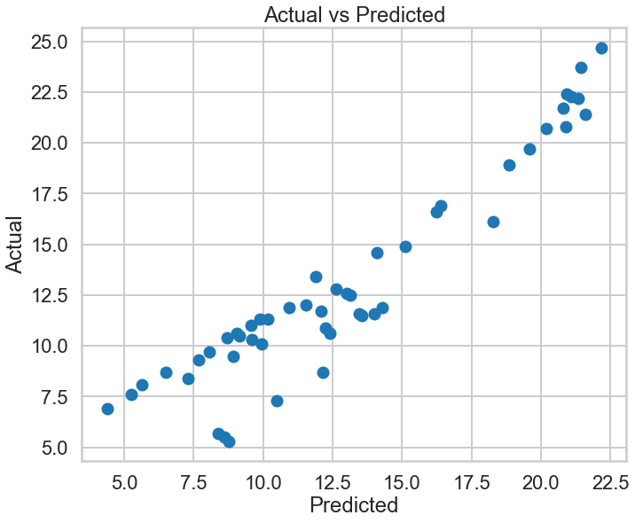
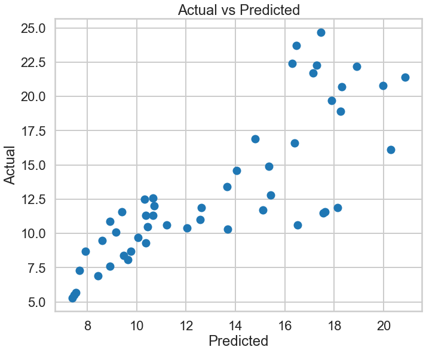

<u>**MACHINE LEARNING EXERCISE: LINEAR REGRESSION**</u>
# ADVERTISING

Linear Regression model is one of the simplest predictive model in Machine Learning. It predicts by deriving a straight-line formula based on the data fit on it. But as simple as it is, Linear Regression can still be an effective model such as in use-cases like this.

**About**
* This dataset was uploaded in Kaggle. It contains data on the budget allocated for TV, radio and newspaper advertisements with the resulting sales.

**Target Variable**
* (int) Sales

**Predictors**
1. (int) TV - Budget of advertisements in TV
1. (int) Radio - Budget of advertisements in radio
1. (int) Newspaper - Budget of advertisements in newspaper

**Sources**
* https://towardsdatascience.com/linear-regression-python-implementation-ae0d95348ac4
* https://www.kaggle.com/sazid28/advertising.csv

## Import Libraries


```python
##### Standard Libraries #####
import numpy as np
import pandas as pd
import matplotlib.pyplot as plt
import seaborn as sns
sns.set_style("whitegrid")
sns.set_context("poster")

%matplotlib inline

##### For Preprocessing #####
from sklearn.model_selection import train_test_split
from sklearn.preprocessing import PolynomialFeatures

##### For Building the Model #####
from sklearn.linear_model import LinearRegression, Lasso, Ridge
from sklearn.pipeline import make_pipeline

##### For Validation of the Model #####
from sklearn.metrics import r2_score, mean_absolute_error, mean_squared_error
from sklearn.model_selection import cross_val_score
```

## Load and Explore the Dataset


```python
### Load the data
df = pd.read_csv("Advertising.csv", index_col = 0)
print("Size of the data:", df.shape)
df.head()
```

    Size of the data: (200, 4)
    


<div>
<style scoped>
    .dataframe tbody tr th:only-of-type {
        vertical-align: middle;
    }

    .dataframe tbody tr th {
        vertical-align: top;
    }

    .dataframe thead th {
        text-align: right;
    }
</style>
<table border="1" class="dataframe">
  <thead>
    <tr style="text-align: right;">
      <th></th>
      <th>TV</th>
      <th>Radio</th>
      <th>Newspaper</th>
      <th>Sales</th>
    </tr>
  </thead>
  <tbody>
    <tr>
      <th>1</th>
      <td>230.1</td>
      <td>37.8</td>
      <td>69.2</td>
      <td>22.1</td>
    </tr>
    <tr>
      <th>2</th>
      <td>44.5</td>
      <td>39.3</td>
      <td>45.1</td>
      <td>10.4</td>
    </tr>
    <tr>
      <th>3</th>
      <td>17.2</td>
      <td>45.9</td>
      <td>69.3</td>
      <td>9.3</td>
    </tr>
    <tr>
      <th>4</th>
      <td>151.5</td>
      <td>41.3</td>
      <td>58.5</td>
      <td>18.5</td>
    </tr>
    <tr>
      <th>5</th>
      <td>180.8</td>
      <td>10.8</td>
      <td>58.4</td>
      <td>12.9</td>
    </tr>
  </tbody>
</table>
</div>


```python
### Get summary of statistics of the data
df.describe()
```


<div>
<style scoped>
    .dataframe tbody tr th:only-of-type {
        vertical-align: middle;
    }

    .dataframe tbody tr th {
        vertical-align: top;
    }

    .dataframe thead th {
        text-align: right;
    }
</style>
<table border="1" class="dataframe">
  <thead>
    <tr style="text-align: right;">
      <th></th>
      <th>TV</th>
      <th>Radio</th>
      <th>Newspaper</th>
      <th>Sales</th>
    </tr>
  </thead>
  <tbody>
    <tr>
      <th>count</th>
      <td>200.000000</td>
      <td>200.000000</td>
      <td>200.000000</td>
      <td>200.000000</td>
    </tr>
    <tr>
      <th>mean</th>
      <td>147.042500</td>
      <td>23.264000</td>
      <td>30.554000</td>
      <td>14.022500</td>
    </tr>
    <tr>
      <th>std</th>
      <td>85.854236</td>
      <td>14.846809</td>
      <td>21.778621</td>
      <td>5.217457</td>
    </tr>
    <tr>
      <th>min</th>
      <td>0.700000</td>
      <td>0.000000</td>
      <td>0.300000</td>
      <td>1.600000</td>
    </tr>
    <tr>
      <th>25%</th>
      <td>74.375000</td>
      <td>9.975000</td>
      <td>12.750000</td>
      <td>10.375000</td>
    </tr>
    <tr>
      <th>50%</th>
      <td>149.750000</td>
      <td>22.900000</td>
      <td>25.750000</td>
      <td>12.900000</td>
    </tr>
    <tr>
      <th>75%</th>
      <td>218.825000</td>
      <td>36.525000</td>
      <td>45.100000</td>
      <td>17.400000</td>
    </tr>
    <tr>
      <th>max</th>
      <td>296.400000</td>
      <td>49.600000</td>
      <td>114.000000</td>
      <td>27.000000</td>
    </tr>
  </tbody>
</table>
</div>


### Exploratory Data Analysis


```python
### Get Correlation of features
df.corr()
```


<div>
<style scoped>
    .dataframe tbody tr th:only-of-type {
        vertical-align: middle;
    }

    .dataframe tbody tr th {
        vertical-align: top;
    }

    .dataframe thead th {
        text-align: right;
    }
</style>
<table border="1" class="dataframe">
  <thead>
    <tr style="text-align: right;">
      <th></th>
      <th>TV</th>
      <th>Radio</th>
      <th>Newspaper</th>
      <th>Sales</th>
    </tr>
  </thead>
  <tbody>
    <tr>
      <th>TV</th>
      <td>1.000000</td>
      <td>0.054809</td>
      <td>0.056648</td>
      <td>0.782224</td>
    </tr>
    <tr>
      <th>Radio</th>
      <td>0.054809</td>
      <td>1.000000</td>
      <td>0.354104</td>
      <td>0.576223</td>
    </tr>
    <tr>
      <th>Newspaper</th>
      <td>0.056648</td>
      <td>0.354104</td>
      <td>1.000000</td>
      <td>0.228299</td>
    </tr>
    <tr>
      <th>Sales</th>
      <td>0.782224</td>
      <td>0.576223</td>
      <td>0.228299</td>
      <td>1.000000</td>
    </tr>
  </tbody>
</table>
</div>


```python
### Visualize Correlation

# Generate a mask for the upper triangle
mask = np.zeros_like(df.corr(), dtype=np.bool)
mask[np.triu_indices_from(mask)] = True

# Set up the matplotlib figure
f, ax = plt.subplots(figsize=(11, 9))

# Generate a custom diverging colormap
cmap = sns.diverging_palette(220, 10, as_cmap=True)

# Draw the heatmap with the mask and correct aspect ratio
sns.heatmap(df.corr(), mask=mask, cmap=cmap, vmax=.9, square=True, linewidths=.5, ax=ax)
```


    <matplotlib.axes._subplots.AxesSubplot at 0x1e2c38a0048>





Since *Sales* is our target variable, we should identify which variable correlates the most with *Sales*. 

As we can see, *TV* has the highest correlation with *Sales*. 

Let's visualize the relationship of variables using scatterplots.


```python
### Visualize the relationship using scatterplot

f, ax = plt.subplots(figsize=(11, 9))
plt.scatter(df["TV"], df["Sales"])
plt.xlabel("TV")
plt.ylabel("Sales")
plt.title("Sales vs TV")

f, ax = plt.subplots(figsize=(11, 9))
plt.scatter(df["Radio"], df["Sales"])
plt.xlabel("Radio")
plt.ylabel("Sales")
plt.title("Sales vs Radio")

f, ax = plt.subplots(figsize=(11, 9))
plt.scatter(df["Newspaper"], df["Sales"])
plt.xlabel("Newspaper")
plt.ylabel("Sales")
plt.title("Sales vs Radio")
```


    Text(0.5, 1.0, 'Sales vs Radio')











Backing up the findings using correlation, the relationship between *Sales* and *TV* is more linear.

Now, let's look at the relationship between the predictors.


```python
### Visualize the relationship using scatterplot

f, ax = plt.subplots(figsize=(11, 9))
plt.scatter(df["TV"], df["Radio"])
plt.xlabel("TV")
plt.ylabel("Radio")
plt.title("Radio vs TV")

f, ax = plt.subplots(figsize=(11, 9))
plt.scatter(df["Radio"], df["Newspaper"])
plt.xlabel("Radio")
plt.ylabel("Newspaper")
plt.title("Newspaper vs Radio")

f, ax = plt.subplots(figsize=(11, 9))
plt.scatter(df["Newspaper"], df["Radio"])
plt.xlabel("Newspaper")
plt.ylabel("Radio")
plt.title("Radio vs Radio")
```


    Text(0.5, 1.0, 'Radio vs Radio')











It seems there's no clear linear relationships between the predictors.

At this point, we know that the variable *TV* will more likely give better prediction of *Sales* because of the high correlation and linearity of the two.

## Prep the Data for Modelling


```python
### Separate the predictor and the target variable 
x = df.drop("Sales", axis = 1)
y = df["Sales"]

print(f"==x (predictors)==\nSize: {x.shape}\n{x.head()}\n Data Type: {type(x.head())} ")
print(f"\n==y (target)==\nSize: {y.shape}\n{y.head()}\n{type(y.head())}")
```

    ==x (predictors)==
    Size: (200, 3)
          TV  Radio  Newspaper
    1  230.1   37.8       69.2
    2   44.5   39.3       45.1
    3   17.2   45.9       69.3
    4  151.5   41.3       58.5
    5  180.8   10.8       58.4
     Data Type: <class 'pandas.core.frame.DataFrame'> 
    
    ==y (target)==
    Size: (200,)
    1    22.1
    2    10.4
    3     9.3
    4    18.5
    5    12.9
    Name: Sales, dtype: float64
    <class 'pandas.core.series.Series'>
    


```python
### Train-Test Split
x_train, x_test, y_train, y_test = train_test_split(x, y, test_size=0.25, random_state = 42)

print("x_train size:", x_train.shape)
print("y_train size:", y_train.shape)
print("\nx_test size:", x_test.shape)
print("y_test size:", y_test.shape)
```

    x_train size: (150, 3)
    y_train size: (150,)
    
    x_test size: (50, 3)
    y_test size: (50,)
    


```python
### Initialize dataframe that will store the results
df_results = pd.DataFrame(columns = ["Predictor/s", "R2", "MAE", "MSE", "RMSE", "Cross-Val Mean"])
```

## Build then Evaluate the Models

### Linear Regression


```python
### Make a function for Linear Regression with default values
def linreg_model(xtrain, xtest):
    ### Initialize algorithm
    linreg = LinearRegression()

    ### Fit the data
    linreg.fit(xtrain, y_train)
    
    ### Evaluate the model
    y_pred = linreg.predict(xtest)
    
    print("R2:", r2_score(y_pred, y_test))
    print("MAE:", mean_absolute_error(y_pred, y_test))
    print("MSE:", mean_squared_error(y_pred, y_test))
    print("RMSE:", np.sqrt(mean_squared_error(y_pred, y_test)))
    
    f, ax = plt.subplots(figsize=(11, 9))
    plt.scatter(y_pred, y_test)
    plt.xlabel("Predicted")
    plt.ylabel("Actual")
    plt.title("Actual vs Predicted")
    
    return {"R2": r2_score(y_pred, y_test) * 100, "MAE": mean_absolute_error(y_pred, y_test), 
            "MSE": mean_squared_error(y_pred, y_test), "RMSE": np.sqrt(mean_squared_error(y_pred, y_test))}
```

#### Using all predictors
The results of this model that uses all of the predictor variable will be our basis on the next models.


```python
### Predict and get results
linreg_all_results = linreg_model(x_train, x_test)

### Cross Validation
cv_score = cross_val_score(LinearRegression(), x, y, cv=10)

print("Cross-Val Results:", cv_score)
print("Cross-Val Mean:", cv_score.mean())

### Compile validation results
linreg_all_results.update({"Predictor/s":"All", "Cross-Val Mean": cv_score.mean() * 100})

### Add the results to the dataframe
df_results = df_results.append(linreg_all_results, ignore_index=True)
```

    R2: 0.8843196200174288
    MAE: 1.402312498938508
    MSE: 2.8800237300941944
    RMSE: 1.6970632663793634
    Cross-Val Results: [0.87302696 0.8581613  0.92968723 0.89013272 0.93146498 0.93138735
     0.7597901  0.91217097 0.83891753 0.92882311]
    Cross-Val Mean: 0.8853562237979616
    





#### Using only *TV* as predictor
Since *TV* shows more correlation and linearity with our target variable, let's try predicting *Sales* using only this variable.


```python
### Predict and get results
linreg_TV_results = linreg_model(x_train["TV"].values.reshape(-1,1), x_test["TV"].values.reshape(-1,1))

### Cross Validation
cv_score = cross_val_score(LinearRegression(), x["TV"].values.reshape(-1, 1), y, cv=10)

print("Cross-Val Results:", cv_score)
print("Cross-Val Mean:", cv_score.mean())

### Compile validation results
linreg_TV_results.update({"Predictor/s":"TV", "Cross-Val Mean": cv_score.mean() * 100})

### Add the results to the dataframe
df_results = df_results.append(linreg_TV_results, ignore_index=True)
```

    R2: 0.4310048090294476
    MAE: 2.2737705943708724
    MSE: 9.179298570399792
    RMSE: 3.029735726164873
    Cross-Val Results: [0.70015158 0.43449405 0.58322591 0.78975123 0.47952235 0.62298657
     0.66525353 0.60389703 0.16530872 0.64237498]
    Cross-Val Mean: 0.5686965937483904
    





Eventhough *TV* is more correlated and linear on Sales, this model does not perform well compared to the model that uses all predictors.

#### Using *TV* and *Radio* as predictors
The top 2 predictor variables based on the EDA above are *TV* and *Radio*, so let's see if the combination of these variables makes a better model.


```python
linreg_TVR_results = linreg_model(x_train[["TV", "Radio"]], x_test[["TV", "Radio"]])

### Cross Validation
cv_score = cross_val_score(LinearRegression(), x[["TV", "Radio"]], y, cv=10)

print("Cross-Val Results:", cv_score)
print("Cross-Val Mean:", cv_score.mean())

### Compile validation results
linreg_TVR_results.update({"Predictor/s":"TV & Radio", "Cross-Val Mean": cv_score.mean() * 100})

### Add the results to the dataframe
df_results = df_results.append(linreg_TVR_results, ignore_index=True)
```

    R2: 0.8850764340201793
    MAE: 1.3886802126434383
    MSE: 2.8539947557761023
    RMSE: 1.6893770318599997
    Cross-Val Results: [0.87936561 0.85860496 0.92960574 0.89040105 0.93302554 0.93129743
     0.76486772 0.91373255 0.83925519 0.92951475]
    Cross-Val Mean: 0.8869670516810129
    


This model is slightly better than the model that uses all of the predictor variables.

## Conclusion


```python
df_results.set_index("Predictor/s", inplace = True)
df_results.head()
```


<div>
<style scoped>
    .dataframe tbody tr th:only-of-type {
        vertical-align: middle;
    }

    .dataframe tbody tr th {
        vertical-align: top;
    }

    .dataframe thead th {
        text-align: right;
    }
</style>
<table border="1" class="dataframe">
  <thead>
    <tr style="text-align: right;">
      <th></th>
      <th>R2</th>
      <th>MAE</th>
      <th>MSE</th>
      <th>RMSE</th>
      <th>Cross-Val Mean</th>
    </tr>
    <tr>
      <th>Predictor/s</th>
      <th></th>
      <th></th>
      <th></th>
      <th></th>
      <th></th>
    </tr>
  </thead>
  <tbody>
    <tr>
      <th>All</th>
      <td>88.431962</td>
      <td>1.402312</td>
      <td>2.880024</td>
      <td>1.697063</td>
      <td>88.535622</td>
    </tr>
    <tr>
      <th>TV</th>
      <td>43.100481</td>
      <td>2.273771</td>
      <td>9.179299</td>
      <td>3.029736</td>
      <td>56.869659</td>
    </tr>
    <tr>
      <th>TV &amp; Radio</th>
      <td>88.507643</td>
      <td>1.388680</td>
      <td>2.853995</td>
      <td>1.689377</td>
      <td>88.696705</td>
    </tr>
  </tbody>
</table>
</div>


**The Linear Regression model that uses the predictors *TV* and *Radio* performs the best out of all the models tried.**

These results mean that advertising on *TV* and *Radio* contribute the most in *Sales*, and  *Newspaper* advertisements have little effect in *Sales*. 

Based on these findings, it is recommended that the marketer or the business owner shall **allocate more budget on *TV* and *Radio* advertisements rather than *Newspaper***.

## Special Thanks
* [FTW Foundation](https://www.ftwfoundation.org/)
